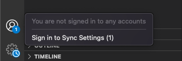
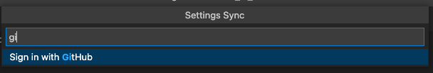
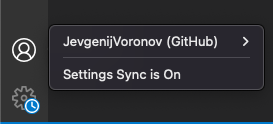
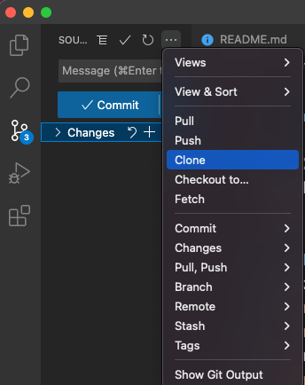
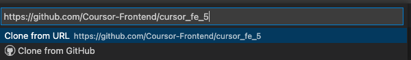
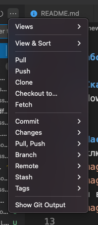

# Работа с GIT

## Скачать и установить
windows     https://git-scm.com/download/win  
mac         https://sourceforge.net/projects/git-osx-installer/  

## Настроить
подключить github аккаунт к visual studio code  
    
    
Если всё получилось то вы должны увидеть свой аккаунт в настройках  
  

## Клонировать репозиторий  
- создать в удобном месте папочку на вашем компьютере где будете хранить наш проект  
- склонировать репозиторий  
   
- ссылка на репозиторий https://github.com/Coursor-Frontend/cursor_fe_5  
  

## команды GIT
- клонировать репозиторий                           -> git clone 			
- обновить локальный репозиторий (на компьютере)    -> git pull  
- создать свою ветку                                -> git create branch 		
- зафиксировать изменения                           -> git commit			
- отправить изменения в репозиторий                 -> git push 
   
